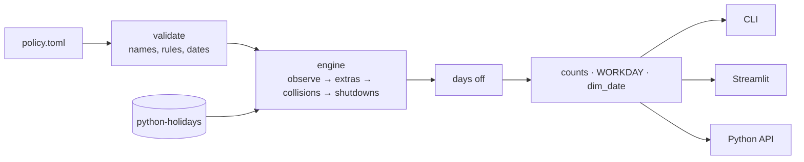

# workcal: company holiday policies as config

[](https://github.com/lzhao-byte/workcal/actions/workflows/ci.yml)

Official holiday calendars (from [python-holidays](https://github.com/vacanza/holidays)) tell you when *public* holidays fall. They don't tell you how many days *your company* actually works. Companies differ in:

- which public holidays they observe,
- where a weekend holiday is moved to,
- extra days off (the Friday after Thanksgiving, Christmas Eve),
- year-end shutdowns,
- even which days count as the weekend.

**workcal** turns that policy into a small TOML file and gives you three things on top of it:

- **Workday counts:** per month, or between any two dates. For example, "sales per selling day" needs this to normalize months with different numbers of workdays.
- **`WORKDAY()`-style date arithmetic:** "10 business days after the order date", for SLAs and lead times.
- **A `dim_date` table:** one row per day with workday, holiday, and fiscal attributes, ready to load into a warehouse or use as a dbt seed.

It ships as a Python library, a CLI, and a Streamlit app.

## A policy is a TOML file

```toml
name = "US corporate (example)"
country = "US"                      # any country (and subdivision) python-holidays supports, or market = "NYSE"
observe = ["New Year's Day", "Martin Luther King Jr. Day", "Memorial Day", "Independence Day",
           "Labor Day", "Thanksgiving", "Christmas Day"]

[observance]
default = "nearest_workday"         # Saturday -> Friday, Sunday -> Monday
overrides = { "New Year's Day" = "next_workday" }   # keep New Year's in the new year

[[extra]]
name = "Day after Thanksgiving"
date = { holiday = "Thanksgiving", offset_days = 1 }

[[extra]]
name = "Christmas Eve"
date = { month = 12, day = 24 }

[[shutdown]]
name = "Year-end shutdown"
start = { observed = "Christmas Eve" }
end = { month = 12, day = 31 }
replaces = ["Christmas Eve", "Christmas Day"]
```

Built-in presets: `us-federal`, `us-corporate-example`, `uk-england`, `nyse`. See [`src/workcal/presets/`](src/workcal/presets/).

| Setting | Options |
|---|---|
| Source calendar | `country` (+ optional `subdiv`) or financial `market` |
| Weekend | any days, e.g. `weekend = ["fri", "sat"]` |
| Weekend-holiday rule | `nearest_workday`, `previous_workday`, `next_workday`, `none`; per-holiday `overrides`; or `official = true` to use the country's own rules |
| Clashes | `on_collision = "next_workday"`: if Christmas and Boxing Day both land on a weekend, they take Monday and Tuesday |
| Extra days | fixed date, offset from a holiday, or offset from Easter (`{ easter = -2 }` is Good Friday) |
| Shutdowns | any block of days, anchored to fixed dates or holidays |

Policies are validated when they load. A misspelled holiday name fails with a suggestion ("did you mean 'Independence Day'?") instead of silently changing the count.

## Quick start

```bash
uv sync --all-extras                # or: pip install -e ".[app]"
uv run streamlit run webapp.py      # the app
uv run workcal --help               # the CLI
```

```console
$ workcal count 2026-01-01 2026-12-31 --policy us-corporate-example
248
$ workcal add 2026-11-25 1 --policy us-corporate-example     # skips Thanksgiving + the Friday after
2026-11-30
$ workcal by-month 2026 --policy us-corporate-example
 year  month  calendar_days  weekend_days  holidays  workdays
 2026      1             31             9         2        20
 2026      2             28             8         0        20
 ...
$ workcal dim-date 2020-01-01 2030-12-31 --policy my_company.toml --fiscal-start 10 -o dim_date.parquet
```

```python
import datetime as dt
from workcal import WorkCalendar

cal = WorkCalendar.from_preset("us-corporate-example")  # or a path to your own .toml
cal.workdays_between(dt.date(2026, 1, 1), dt.date(2026, 3, 31))
cal.add_workdays(dt.date(2026, 12, 18), 5)
dim = cal.date_dimension(dt.date(2020, 1, 1), dt.date(2030, 12, 31), fiscal_year_start_month=10)
```

## The `dim_date` table

| Column | Meaning |
|---|---|
| `date`, `year`, `quarter`, `month`, `month_name`, `day_of_month`, `day_of_week` (ISO, Mon = 1), `day_name`, `iso_year`, `iso_week` | calendar attributes |
| `is_weekend`, `is_holiday`, `holiday_name`, `is_workday` | policy attributes (`holiday_name` joins clashing holidays with `; `) |
| `workday_of_month`, `workdays_in_month`, `workdays_remaining_in_month` | pacing within the month, e.g. "day 12 of 21" |
| `fiscal_year`, `fiscal_quarter` | for any fiscal start month; the fiscal year is labeled by the year it ends in |

Month-level columns are always computed over whole months, even when the requested range starts or ends mid-month.

Typical use once it's in the warehouse:

```sql
-- sales per workday, comparable across months with different numbers of workdays
select d.year, d.month, sum(s.amount) / max(d.workdays_in_month) as sales_per_workday
from fct_sales s
join dim_date d on d.date = s.order_date
group by 1, 2;
```

## How it's tested



- **Regression against v1:** version 1 of this tool hard-coded one company's rules behind five switches. [`tests/test_legacy_parity.py`](tests/test_legacy_parity.py) runs all 32 switch combinations through a frozen copy of v1 and through v2 with the equivalent config. Monthly workday counts and days off match exactly for every month from 2000 to 2040.
- **Cross-check against official rules:** the `us-federal` and `uk-england` presets re-derive observed dates with workcal's own rule engine. They match python-holidays' official observed dates for 2000–2040.
- **Property-based tests** ([Hypothesis](https://hypothesis.readthedocs.io/)): for random dates and offsets, `add_workdays` always lands on a workday, and `workdays_between` recovers the offset.
- **App smoke tests:** the Streamlit app runs headless with `streamlit.testing.AppTest`.
- **CI:** ruff and pytest on Python 3.11–3.13, plus one run on the oldest supported versions (`holidays` 0.41, `pandas` 2.0). A weekly scheduled run catches upstream changes in python-holidays. One such change already happened: an upstream rename of "Thanksgiving" to "Thanksgiving Day" silently dropped the holiday in v1.

## Project layout

```
src/workcal/
  policy.py      # TOML schema, validation, name matching
  calendar.py    # WorkCalendar: observance engine, counts, WORKDAY, dim_date
  cli.py         # `workcal` command
  presets/       # built-in policies
webapp.py        # Streamlit app
tests/           # unit, property, parity, official cross-check, app smoke tests
```
